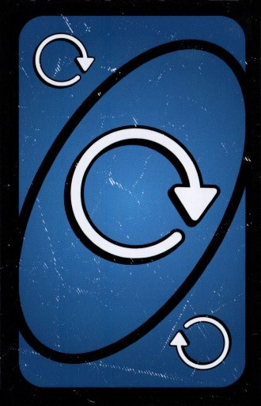

# 🎮 UnoNoMercy – Regole del Gioco

Benvenuto in **UnoNoMercy**, la versione spietata del classico UNO!
Qui troverai le regole ufficiali, le meccaniche speciali e le modalità opzionali che rendono questa variante davvero **senza pietà**.

---

## 🧩 Regole di Base

- Ogni giocatore inizia con **7 carte**.
- Il gioco segue le stesse regole fondamentali del classico UNO:

- puoi giocare una carta che **abbia lo stesso colore o lo stesso numero** di quella sul tavolo;
- se non puoi giocare, **peschi una carta** dal mazzo;
- se puoi giocarla subito, puoi farlo nello stesso turno.
- Non dimenticare di **gridare “UNO!”** quando ti rimane una sola carta — se non lo fai e vieni colto in flagrante, **peschi 2 carte** di penalità.
- Il turno prosegue in senso orario, a meno che non venga invertito da una carta speciale.

---

## 🃏 Tipi di Carte

### Carte numeriche

- Valori da **0 a 9** in **quattro colori** (rosso, blu, giallo, verde).
- Seguono le regole standard di abbinamento per colore o numero.

### Carte azione

| CARTA | EFFETTO |
|-|-|
|| il giocatore successivo deve pescare 2 carte e saltare il turno.|
||**Pesca Quattro:** il giocatore successivo deve pescare 4 carte e saltare il turno.|
||**Salta Giro:** quando giocate questa carta, il giocatore successivo salta il turno.|
||**Cambia Giro:** quando giocate questa cart**Pesca Due:**a, la direzione del gioco si inverte. Se il gioco procedeva in senso orario, ora andrà in senso antiorario e viceversa. Se siete solo in due a giocare, una carta Cambia Giro fa saltare il turno all’altro giocatore, facendo voi giocare di nuovo.|
|  | **Scarta Tutto:** Giocate tutte le carte che avete in mano che corrispondono al colore della carta Scarta Tutto. Posizionate le carte extra sotto la carta Scarta Tutto. **N.B.** gli effetti delle carte speciali giocate non vengono applicati. |
|| giocando questa carta fai saltare il turno a tutti i giocatori e giocate di nuovo.|

### Carte Jolly

| CARTA | EFFETTO|
|-|-|
|| **Jolly Cambia Giro Pesca 4:** Cambia la direzione del gioco, quindi il giocatore successivo nella nuova direzione deve pescare 4 carte e saltare il turno. Se siete solo in due a giocare, questa carta fa saltare il turno all’altro giocatore, facendo pescare a VOI 4 carte! Potete utilizzare la regola dell’“accumulare†per far subire la penalità all’altro giocatore. Questa vale anche come carta Jolly, quindi potrete decidere il colore con cui proseguire il gioco.|
||**Jolly Pesca 6:** Il giocatore successivo deve pescare 6 carte e saltare il turno. Questa vale anche come carta Jolly, quindi potrete decidere il colore con cui proseguire il gioco.|
||**Jolly Pesca 10:** Il giocatore successivo deve pescare 10 carte e saltare il turno. Questa vale anche come carta Jolly, quindi potrete decidere il colore con cui proseguire il gioco.|
||**Jolly Roulette Colore:** Il giocatore successivo sceglie un colore. Dopo di che, deve alzare e mostrare le carte del Mazzo di Pesca una alla volta finché trova una carta di quel colore (le carte Jolly NON contano). Tutte le carte mostrate diventeranno sue e salterà il turno. Il gioco riprende con il colore scelto.|

---

## 💥 Regole Speciali “No Mercy”

Queste regole rendono *UnoNoMercy* più dinamico, tattico e imprevedibile.

### 🔁 Catena di Pesca

Se un giocatore gioca un **+2** o un **+4**, il successivo può **impilare** un’altra carta “+” dello stesso tipo o di valore superiore.
Il totale si accumula, e il primo giocatore che non può (o non vuole) rispondere **pesca l’intera somma**.

> Esempio:
> Alice gioca +2 → Bob gioca +4 → Chiara non ha carte “+” → Chiara pesca **6 carte**.

---

### 💀 Limite di Carte

- Se un giocatore raggiunge **25 carte o più**, viene **eliminato automaticamente**.
  Nessuna pietà, come suggerisce il nome del gioco.

---

### ⚖️ Doppia Punizione

Se un giocatore dimentica di dire **UNO!** prima di finire il turno, oltre a pescare 2 carte perde **il turno successivo**,

---

### carta 7 e carta 0

Ogni carta 7 permette al giocatore che l'ha giocata di cambiare le proprie carte con uno degli altri giocatori indipendentemente se è vicino oppure no.

Ogni carta 0 fa ruotare le carte in base al senso di gioco a tutti i giocatori.

---

## 🏆 Vittoria

Il primo giocatore che si libera di tutte le carte **vince la partita**.

> “Non esistono amici, solo avversari in attesa del loro turno.” 😈
